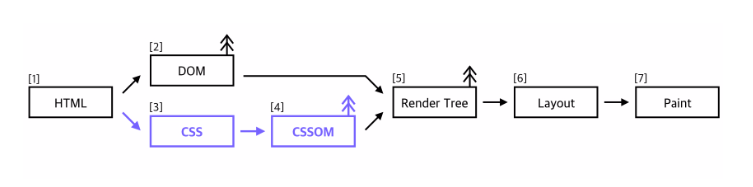
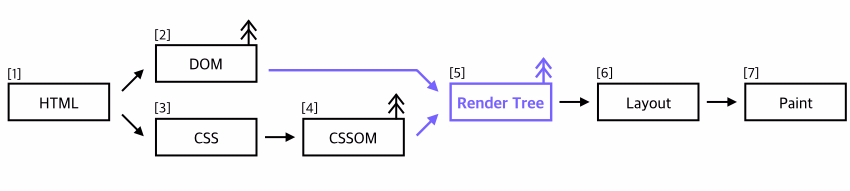
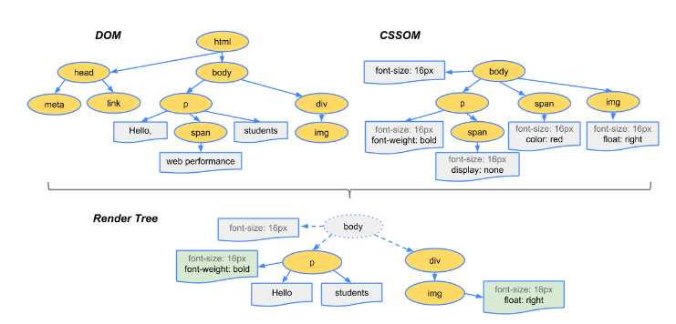
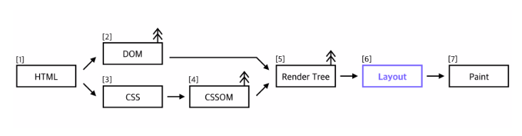
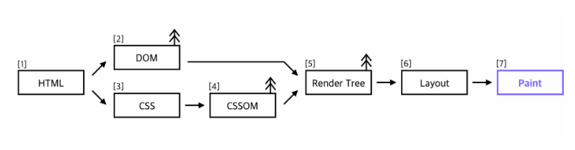

1. **CSS 마크업 처리 후 CSSOM 트리 빌드(어떻게)**
  - **CSS에서 CSSOM으로**

    

    - HTML을 파싱하다 CSS링크를 만나면, CSS파일을 요청해서 받아온다. 받아온 CSS파일은 HTML을 파싱한 것과 유사한 과정을 거쳐 역시 Tree형태의 CSSOM으로 만들어 진다. CSS 파싱은 CSS 특성상 자식 노드들이 부모 노드의 특성을 계속해서 이어받는(cascading) 규칙이 추가되는 것을 빼고는 HTML 파싱과 동일하게 이루어진다. 이렇게 CSSOM을 구성하는 것이 끝나야 이후의 Rendering 과정을 시작할 수 있기 때문에 CSS는 redering의 blocking 요소라고 한다.
2. **DOM, CSSOM 을 결합하여 렌더링 트리 형성(화면에 그려질 것 결정)**

   

  - **DOM(Content) CSSOM(Style) = Render Tree**
    - DOM 과 CSSOM을 합쳐 Render Tree가 만들어지게 되는데. Render Tree는 화면에 실제 보이는 내용들로만 이루어 진다. 만약 CSS에서 display: none으로 설정했다면, 그 노드(자식 노드 포함)는 Render Tree에 추가되지 않는다. 마찬가지로 <header> 태그 안의 내용들도 Render Tree에는 포함되지 않는다. 그래서 아래 그림처럼 Render Tree에서는 <header>태그와 속성이 display: none인 태그는 제외된 것을 확인할 수 있다.

    

3. **렌더링 트리에서 레이아웃을 실행하여 각 노드의 기하학적 형태 계산(Box-Model 생성)**
  - **Layout(reflow)**

    

    - Render Tree가 다 만들어지면, Render Tree에 있는 각각의 노드들이 화면의 어디에 위치할 지를 계산하는 Layout과정을 거친다. CSSOM에서 가져온 스타일 정보들로 어떻게 생겨야 한다는 것을 알고 있지만, 실제로 놓으려면 어디에 가야하는지 계산하는 과정을 위해 CSS box model이 쓰이며, position, width, height 등등 틀과 위치에 관련된 부분들을 통해 계산해서 그리게 되는데 이 과정을 Webkit에서는 layout, Gecko에서는 reflow로 부른다.
4. **개별 노드를 화면에 페인트.**
  - **Paint(repaint)**

    

    - Render Tree의 각 노드들을 실제로 화면에 그림(정말로 눈에 보이는 픽셀들 visibility, outline, background-color)